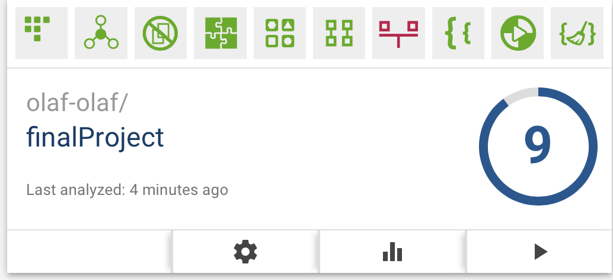

I've already updated my project yesterday with help of bettercodehub. I didn't score very well on the 'keep unit interfaces small' 
part of clean code. I updated some functions parameters by getting rid of paremeters I didn't end up using and putting other variables into
objects. Here's a picture of my score now. I didn't make one of my initial score, the only difference is that the 'keep unit interfaces small'
logo was red. 

